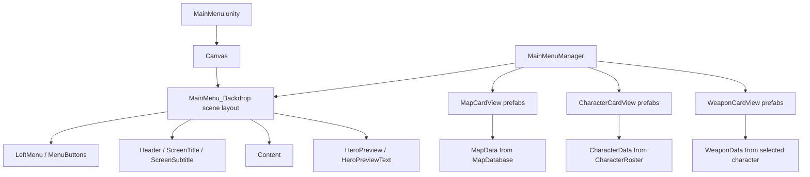

# Main Menu Workflow

Этот документ описывает текущую систему главного меню: что редактируется руками в сцене, что создается из данных, и как настраивать карточки карт, персонажей и оружия.

## Общая Идея

Главное меню теперь разделено на два слоя:

- Сценовый каркас: фон, левая навигация, заголовок, область контента и превью выбранного героя.
- Динамический контент: карточки карт, персонажей и оружия, которые заполняются из `MapData`, `CharacterData` и `WeaponData`.



## Где Что Лежит

`Assets/Scenes/MainMenu.unity`

- Сцена главного меню.
- Здесь должен быть `Canvas`, `EventSystem` и объект `MainMenuRoot` с компонентом `MainMenuManager`.
- Внутри `Canvas` может быть создан редактируемый каркас `MainMenu_Backdrop`.

`Assets/Scripts/UI/MainMenuManager.cs`

- Управляет навигацией меню.
- Читает персонажей из `CharacterRoster`.
- Читает карты из `MapDatabase`.
- Сохраняет выбранного персонажа, оружие и карту через selected stores.
- Заполняет карточки данными.

`Assets/Scripts/UI/MenuCardViewBase.cs`

- Общая база для карточек меню.
- Хранит ссылки на `Button`, `Image`, `Title`, `Body`.
- Умеет менять выбранное/невыбранное состояние карточки.

`Assets/Scripts/UI/MapCardView.cs`

- Карточка карты.
- Показывает название, биом и сложность.

`Assets/Scripts/UI/CharacterCardView.cs`

- Карточка персонажа.
- Показывает имя и основные характеристики.

`Assets/Scripts/UI/WeaponCardView.cs`

- Карточка оружия.
- Показывает имя, стартовый навык и краткое описание.

`Assets/Prefabs/UI`

- Здесь должны лежать prefab-карточки меню.
- `MapCardView.prefab`
- `CharacterCardView.prefab`
- `WeaponCardView.prefab`

## Как Создать Каркас Меню В Сцене

1. Открой сцену `Assets/Scenes/MainMenu.unity`.
2. Выбери объект `MainMenuRoot`.
3. В инспекторе найди компонент `MainMenuManager`.
4. Нажми кнопку `Rebuild Scene Menu Layout`.
5. Внутри `Canvas` появится объект `MainMenu_Backdrop`.
6. Теперь можно вручную двигать фон, левое меню, заголовок, `Content` и блок превью героя.

Важно: не переименовывай ключевые объекты без необходимости:

- `MainMenu_Backdrop`
- `Header`
- `ScreenTitle`
- `ScreenSubtitle`
- `LeftMenu`
- `MenuButtons`
- `Content`
- `HeroPreview`
- `HeroPreviewText`

`MainMenuManager` ищет эти имена, чтобы подключиться к уже существующему сценовому UI.

## Как Создать Prefab-Карточки

Самый быстрый путь:

1. Открой сцену `MainMenu`.
2. Выбери `MainMenuRoot`.
3. На компоненте `MainMenuManager` нажми `Create And Assign Default Card Prefabs`.
4. Unity создаст prefab-карточки в `Assets/Prefabs/UI`.
5. Эти prefab автоматически привяжутся к `MainMenuManager`.

После этого можно открыть каждый prefab и менять внешний вид:

- размеры;
- цвета;
- шрифты;
- расположение `Title` и `Body`;
- фон;
- декоративные элементы;
- иконки, если позже добавим поля для них.

## Как Должен Быть Устроен Prefab Карточки

Минимальная структура:

```text
MapCardView.prefab
├── RectTransform
├── Image
├── Button
├── LayoutElement
├── MapCardView
├── Title (Text)
└── Body (Text)
```

Для персонажа и оружия структура такая же, только компонент другой:

```text
CharacterCardView.prefab
└── CharacterCardView

WeaponCardView.prefab
└── WeaponCardView
```

`Title` и `Body` желательно не переименовывать. Если переименовать, нужно вручную назначить ссылки в компоненте карточки.

## Что Можно Редактировать Руками

Можно безопасно редактировать:

- расположение блоков в `MainMenu_Backdrop`;
- размер левой панели;
- позиции заголовков;
- размер области `Content`;
- внешний вид prefab-карточек;
- цвета и размеры текстов;
- фоновые изображения и декоративные элементы.

Нужно быть аккуратным с:

- удалением `Content`, потому что туда создаются динамические карточки;
- переименованием ключевых объектов;
- удалением `Button` с prefab-карточек;
- удалением `Title` и `Body`, если ссылки не назначены вручную.

## Как Главное Меню Берет Данные

Персонажи:

```text
Assets/Resources/CharacterRoster.asset
-> CharacterData[]
-> CharacterCardView
```

Карты:

```text
Assets/Resources/MapDatabase.asset
-> MapData[]
-> MapCardView
```

Оружие:

```text
Selected CharacterData
-> Available Weapons
-> WeaponCardView
```

## Что Делать Если Карточки Не Появились

Проверь:

- `CharacterRoster.asset` содержит персонажей.
- `MapDatabase.asset` содержит карты.
- У выбранного персонажа заполнен `Available Weapons`.
- В `MainMenuManager` назначены `Map Card Prefab`, `Character Card Prefab`, `Weapon Card Prefab`.
- В prefab карточки есть компонент `Button`.
- В prefab карточки есть нужный view-компонент: `MapCardView`, `CharacterCardView` или `WeaponCardView`.

Если prefab не назначен, меню все равно работает через fallback: карточки создаются кодом как простые кнопки.

## Правильный Следующий Шаг

Следующий хороший слой для меню:

- добавить портреты персонажей в `CharacterData`;
- добавить иконки оружия в `WeaponData`;
- добавить превью/арт карты в `MapData`;
- расширить карточки полями `Icon`, `Portrait`, `PreviewImage`;
- сделать отдельный экран подтверждения перед стартом боя.
