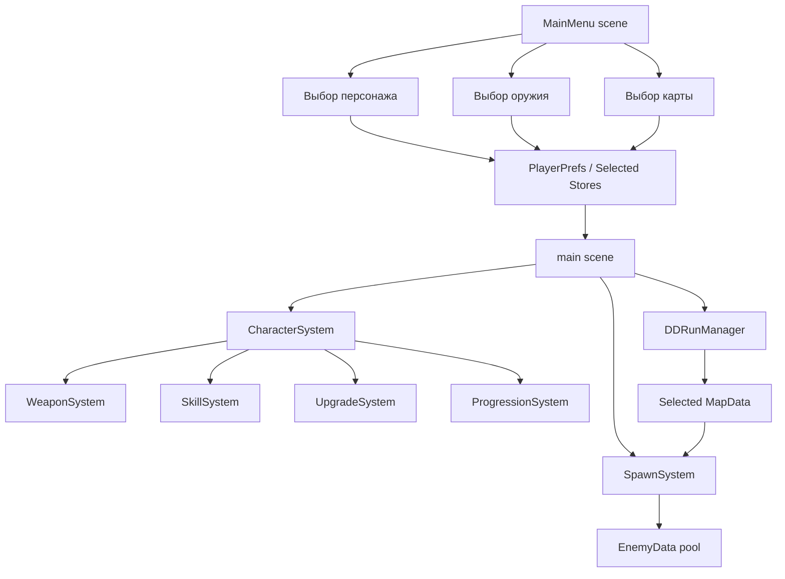
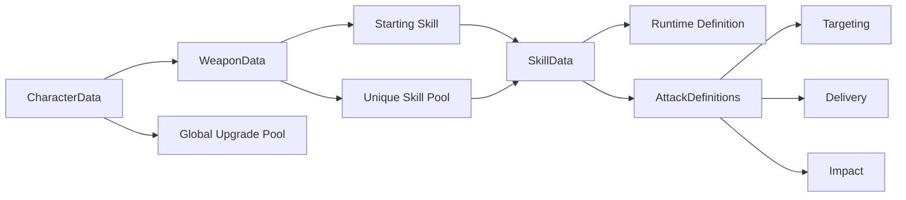
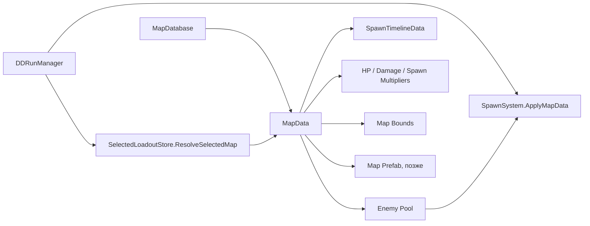
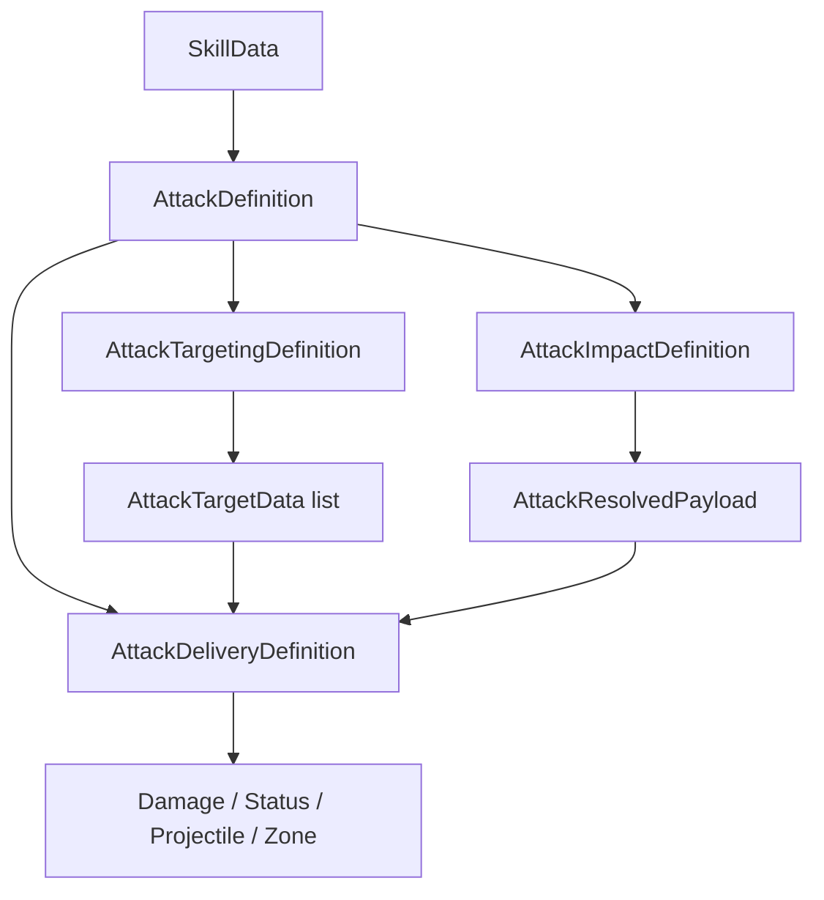
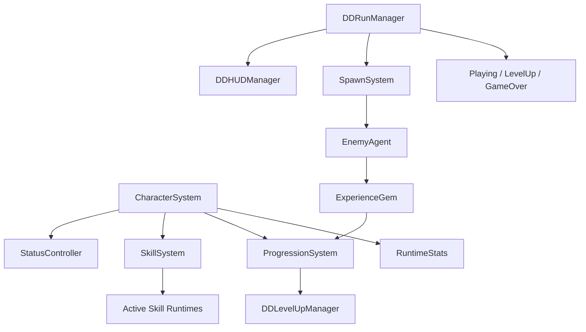
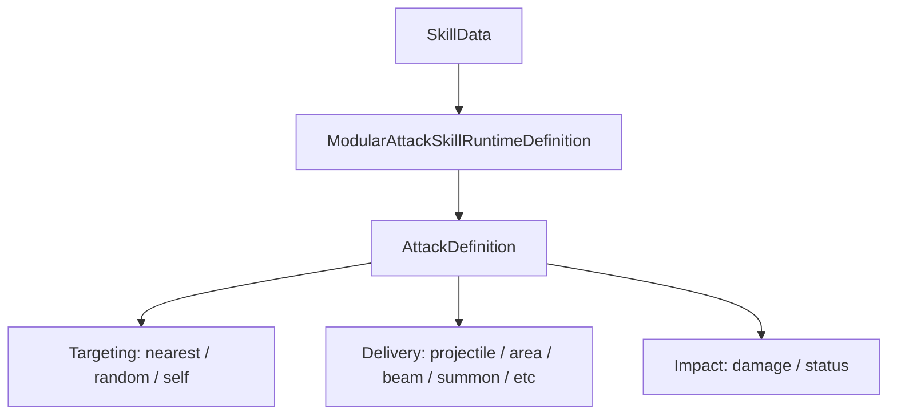

# Карта Проекта

Этот документ нужен, чтобы быстро понять, где что лежит и как части проекта связаны между собой.

## Главная Идея

Проект сейчас устроен как data-driven игра: большая часть контента создаётся через `ScriptableObject` ассеты, а сцены содержат только общие системы боя, меню и UI.



## Сцены

`Assets/Scenes/MainMenu.unity`

- Сцена главного меню.
- Основной скрипт: `MainMenuManager`.
- Показывает выбор карты, персонажа, оружия, дерево навыков и настройки.
- Сохраняет выбранные данные через `SelectedCharacterStore` и `SelectedLoadoutStore`.

`Assets/Scenes/main.unity`

- Базовая боевая сцена.
- Содержит игрока, камеру, HUD, спавнер, ран-менеджер и UI уровня.
- Не должна вручную дублироваться под каждую карту.
- Карты должны подключаться через `MapData`, а позже через `mapPrefab`.

## Основные Папки

`Assets/Scripts/Core`

- `CameraFollow` — камера следует за игроком.
- `ExperienceGem` — кристалл опыта.

`Assets/Scripts/DataDriven/Core`

- Общие примитивы: статы, пул объектов, интерфейсы пула.
- Важные файлы: `StatType`, `StatValue`, `StatModifierData`, `PoolManager`.

`Assets/Scripts/DataDriven/Data`

- Описания контента через `ScriptableObject`.
- Здесь лежат классы данных: `CharacterData`, `WeaponData`, `SkillData`, `EnemyData`, `MapData`, `MapDatabase`, `UpgradeData`, `SpawnTimelineData`.

`Assets/Scripts/DataDriven/Runtime`

- Runtime-контексты и математика.
- Важные файлы: `CombatMath`, `RuntimeStats`, `SkillRuntimeContext`, `CharacterRuntimeState`.

`Assets/Scripts/DataDriven/Attacks`

- Конструктор атак.
- `Targeting` выбирает цель.
- `Delivery` доставляет удар.
- `Impact` применяет урон/статусы.

`Assets/Scripts/DataDriven/Skills`

- Старые и новые runtime-навыки.
- Сейчас лучше использовать modular attack pipeline через `ModularAttackRuntimeDefinition`.

`Assets/Scripts/DataDriven/Systems`

- Главные игровые системы.
- `CharacterSystem` собирает персонажа.
- `WeaponSystem` экипирует оружие.
- `SkillSystem` выдаёт активные навыки.
- `UpgradeSystem` применяет улучшения.
- `ProgressionSystem` управляет уровнем и наградами.
- `SpawnSystem` спавнит врагов.
- `DDRunManager` управляет состоянием забега.

`Assets/Scripts/UI`

- `MainMenuManager` — главное меню.
- `DDHUDManager` — HUD в бою.
- `DDLevelUpManager` — окно выбора навыков/улучшений.

## Папки Данных

```text
Assets/Data
├── Affixes
├── AttackModules
│   ├── Definitions
│   ├── Delivery
│   ├── Impact
│   ├── Runtime
│   └── Targeting
├── Characters
├── Enemies
├── Maps
├── Skills
├── Upgrades
└── Weapons
```

`Assets/Resources`

- `CharacterRoster.asset` — список персонажей для главного меню.
- `MapDatabase.asset` — список карт для главного меню и боя.

## Цепочка Персонажа



## Цепочка Карты



## Цепочка Атаки



Пример:

```text
Skill_ChainLightning
-> Attack_ChainLightning
-> Targeting_NearestEnemy
-> Delivery_Chain
-> Impact_Damage_ChainLightning
```

## Главные Runtime-Связи В Бою



## Что Где Искать

- Хочешь изменить характеристики героя: `Assets/Data/Characters`.
- Хочешь изменить оружие и пул навыков: `Assets/Data/Weapons`.
- Хочешь изменить активный навык: `Assets/Data/Skills` и `Assets/Data/AttackModules`.
- Хочешь изменить врага: `Assets/Data/Enemies`.
- Хочешь изменить состав врагов на карте: `Assets/Data/Maps`.
- Хочешь изменить скорость спавна и рост сложности: `Assets/Data/SpawnTimeline_Default.asset` или отдельный `SpawnTimelineData`.
- Хочешь изменить награды уровня: `Assets/Data/Upgrades` и `ProgressionChoiceGenerator`.
- Хочешь изменить боевые формулы: `Assets/Scripts/DataDriven/Runtime/CombatMath.cs`.
<!-- Update: see Docs/MainMenuWorkflow.md for the current editable main menu and UI card prefab workflow. -->
## Актуальное Состояние Боевой Архитектуры

Боевые навыки сейчас должны создаваться через модульный конструктор атак, а не через отдельный уникальный `Update()`-скрипт под каждый навык.



Актуальные delivery-типы:

- `ProjectileAttackDeliveryDefinition` — одиночный снаряд.
- `ProjectileSpreadAttackDeliveryDefinition` — залп или веер снарядов.
- `AreaPulseAttackDeliveryDefinition` — мгновенный удар по области.
- `DelayedAreaAttackDeliveryDefinition` — удар по области после задержки.
- `LastingAreaAttackDeliveryDefinition` — длительная зона урона.
- `ChainAttackDeliveryDefinition` — последовательная атака по нескольким целям.
- `FrontalConeAttackDeliveryDefinition` — секторный удар перед героем.
- `LineSlashAttackDeliveryDefinition` — вытянутая зона удара.
- `CircularMeleeAttackDeliveryDefinition` — мгновенный круговой удар вокруг героя.
- `CircularSweepAttackDeliveryDefinition` — круговой удар по дуге, имитирующий вращение оружия.
- `BeamAttackDeliveryDefinition` — луч или линия урона.
- `OrbitalAttackDeliveryDefinition` — объект, вращающийся вокруг игрока.
- `SummonAttackDeliveryDefinition` — призыв союзника с базовым ИИ.

`ModularProjectile` поддерживает пробивание и рикошеты:

- `Pierce Count` — сколько врагов снаряд может пробить.
- `Ricochet Count` — сколько раз снаряд может перескочить на новую цель.
- `Ricochet Search Radius` — радиус поиска цели для рикошета.

## Актуальное Состояние Level Up

При повышении уровня окно награды не смешивает разные типы карточек. Система случайно выбирает один тип набора:

- 3 активных навыка.
- 3 улучшения.

Если навыки недоступны, показываются улучшения. Если улучшения недоступны, показываются навыки. Активные навыки выдаются как полноценные навыки, а не как первый уровень навыка.
